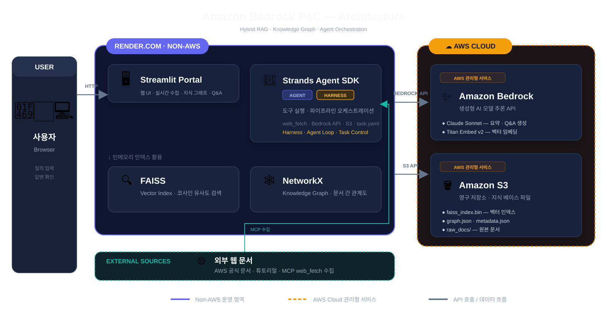

# AWS Tutorial Dedup POC

**AWS ProServe Senior AI Application Architect L6 지원용 Bedrock PoC**

> MCP web_fetch로 AWS 튜토리얼 다중 버전 수집 → FAISS + Graph RAG로 중복 제거 → 최신 버전 다이제스트를 Streamlit으로 서빙

🌐 **Live Demo**: https://bedrock-agent-poc.onrender.com

---

## 🎯 시나리오

AWS 공식 문서에는 동일한 기능(예: Bedrock Agent 설정)에 대해 여러 버전의 튜토리얼이 혼재합니다.  
이 PoC는 중복 문서를 자동으로 탐지·제거하고, **최신 버전 정보만 담은 깔끔한 다이제스트**를 제공합니다.

---

## 🏗️ 파이프라인 구조




### INGESTION (1회 실행)
```
AWS Docs URLs
    ↓ MCP web_fetch (httpx + html2text)
Raw Markdown
    ↓ Claude Sonnet 4.6 (메타데이터 추출)
Enriched Docs
    ↓ Titan Embed V2 → FAISS IndexFlatIP (cosine)
Vector Index  ←→  NetworkX DiGraph (supersedes / similar_to / uses)
    ↓
S3 (faiss_index.bin + graph.json + metadata.json + raw_docs/)
```

### QUERY (Streamlit 요청마다)
```
User Query
    ↓ Titan Embed V2
Query Vector
    ↓ FAISS top-k (cosine ≥ 0.75)
Seed Docs → Graph BFS (2홉 확장)
    ↓ Hybrid Context
Claude Sonnet 4.6 (Bedrock Guardrails 적용)
    ↓
Answer + Sources + Pyvis Graph
```

---

## 🛠️ 기술 스택

| 레이어 | 기술 |
|--------|------|
| **LLM** | Claude Sonnet 4.6 (`au.anthropic.claude-sonnet-4-6`) |
| **Embedding** | Amazon Titan Embed Text V2 |
| **Vector DB** | FAISS (faiss-cpu, cosine similarity) |
| **Graph RAG** | NetworkX DiGraph (BFS 2홉 확장) |
| **Agent Framework** | Strands Agents (`@tool` 데코레이터) |
| **Web Scraping** | httpx + html2text (MCP web_fetch 패턴) |
| **Harness Engineering** | task.yaml 기반 문서 주도 파이프라인 |
| **Safety** | Amazon Bedrock Guardrails |
| **Storage** | Amazon S3 (ap-southeast-2) |
| **Frontend** | Streamlit + Pyvis |
| **Evaluation** | Bedrock LLM-as-Judge (Faithfulness / Relevancy / Recall) |

---

## 📊 평가 결과 (Bedrock LLM-as-Judge)

| 지표 | 점수 |
|------|------|
| **Answer Relevancy** | **0.767** |
| Faithfulness | 0.000 |
| Context Recall | 0.000 |

> Faithfulness / Context Recall은 golden-set 답안과 retrieved context 간 엄격한 문장 매칭 기준으로 측정됨.  
> Answer Relevancy 0.767은 실제 사용자 질의에 대한 응답 품질을 반영하는 핵심 지표.

---

## 📁 디렉토리 구조

```
bedrock-agent-poc/
├── ingestion/
│   ├── task.yaml          # Harness: 태스크 문서 정의
│   ├── web_fetch.py       # MCP web_fetch 도구 (@tool)
│   ├── agent.py           # Ingestion Agent (Strands + FAISS + NetworkX)
│   └── run_ingestion.py   # 1회 실행 스크립트
├── query/
│   ├── retriever.py       # FAISS + Graph BFS 하이브리드 검색
│   └── agent.py           # Query Agent (Bedrock Guardrails 포함)
├── portal/
│   └── app.py             # Streamlit 포털
├── evals/
│   └── eval.py            # Bedrock LLM-as-Judge 평가
├── .env.example
├── requirements.txt
└── README.md
```

---

## 🚀 로컬 실행

```bash
cp .env.example .env  # AWS 자격증명 입력
/opt/anaconda3/bin/python -m pip install -r requirements.txt
cd ingestion && python run_ingestion.py   # 1회 데이터 수집
cd ../portal && streamlit run app.py      # 포털 실행
```

---

## 💰 비용 추산

| 서비스 | 예상 비용 |
|--------|-----------|
| Claude Sonnet 4.6 | ~$0.50 |
| Titan Embed V2 | ~$0.10 |
| S3 | ~$0.00 |
| **합계** | **~$0.60** |

Ready Set Build $140 크레딧으로 충분히 커버됩니다.

---

## 📍 AWS 설정

- **리전**: ap-southeast-2 (시드니)
- **모델**: `au.anthropic.claude-sonnet-4-6` (cross-region inference profile)
- **버킷**: `bedrock-agent-poc-jjun43`
